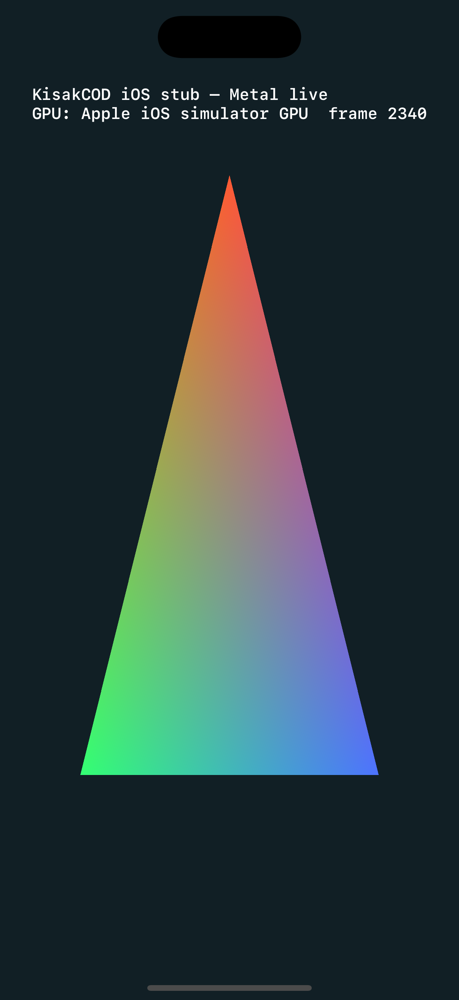
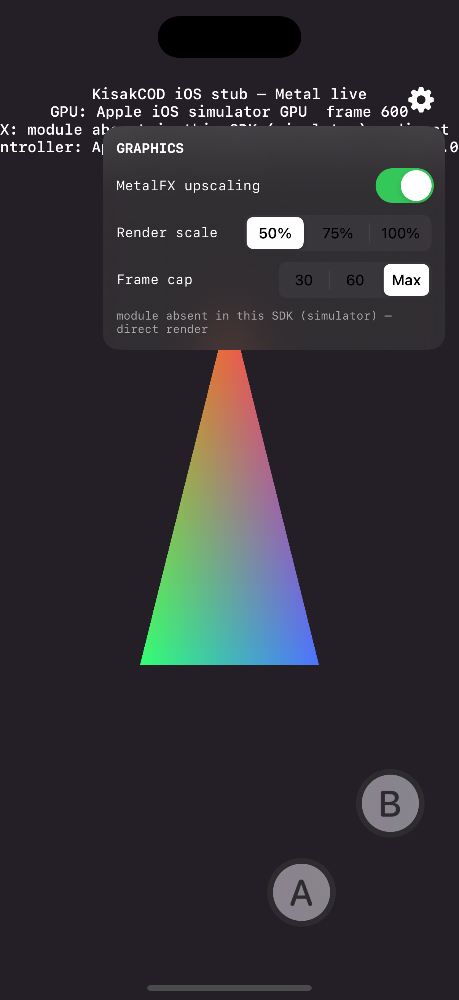
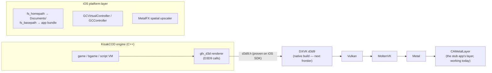

<div align="center">

# BMK4

**B**raxton · **M**etal · **K**isak · **4** — Call of Duty 4, carried over to Apple silicon.
A Bevis Metalworks project, forged from [KisakCOD](https://github.com/SwagSoftware/KisakCOD) by LWSS.

### Porting a from-scratch Call of Duty 4 engine decompilation to `arm64-apple-ios`

[](https://github.com/Braxton-Bevis/bmk4/actions/workflows/ios-stub.yml)
[](https://github.com/Braxton-Bevis/bmk4/actions/workflows/ios-compile-probe.yml)
[](https://github.com/Braxton-Bevis/bmk4/actions/workflows/build-kisarcod-win.yaml)
[](LICENSE)

&nbsp;&nbsp;


*Both screenshots were captured automatically by CI from a booted iOS Simulator — every claim in this repo is machine-verified.*

</div>

---

## What is this?

An engineering experiment: **how far can [KisakCOD](https://github.com/SwagSoftware/KisakCOD) — a GPL-3.0, Win32/x86-32/DirectX 9 reimplementation of the Call of Duty 4 multiplayer engine — be pushed toward running natively on iPhone?**

There is no macOS/Linux/ARM branch to start from. The engine assumes Windows APIs, 32-bit x86 struct layouts, and a D3D9 renderer throughout. This repo documents the platform lift honestly, milestone by milestone, with every compile and launch verified on GitHub Actions macOS runners (Xcode 16.4, iOS 18.5 SDK) — the entire experiment was driven from a Windows laptop with **no local compiler at all**.

> This is a research/porting project. It contains **no game assets** and never will — you must own Call of Duty 4 (2007). It is not affiliated with Activision or Infinity Ward.

## Status at a glance

| Objective | Status |
|---|---|
| iOS app shell: Metal layer, simulator-verified launch, unsigned arm64 `.ipa` artifact | ✅ complete |
| MetalFX spatial upscaling (50/75% → native), runtime + SDK gated | ✅ in the stub |
| Controller support: on-screen `GCVirtualController` + physical gamepads | ✅ in the stub |
| In-app graphics settings menu (MetalFX, render scale, frame cap) | ✅ in the stub |
| Build retarget: `cmake -DKISAK_PLATFORM=ios` + per-file compile census in CI | ✅ complete |
| Windows→iOS dependency map (every API family → concrete replacement) | ✅ [DEPENDENCY_MAP.md](DEPENDENCY_MAP.md) |
| Filesystem sandboxing (`fs_basepath` → app bundle, `fs_homepath` → `Documents/`) | ✅ landed |
| Engine translation units compiling for `arm64-apple-ios` | ✅ **23/23 census TUs** — game logic, script VM, threading (pthreads), FS (POSIX), net (BSD sockets), sound (Miles stub), renderer init |
| D3D9 header layer absorbed by DXVK native headers on the iOS SDK | ✅ proven |
| DXVK d3d9 renderer runtime on iOS | ✅ **LIVE ON DEVICE** — native CAMetalLayer WSI + static MoltenVK; `CreateDevice` D3D_OK, Clear readback bit-exact, `Present` D3D_OK on iPad Pro (M5). [Patch](scripts/platform/ios/dxvk-v2.7.1-ios.patch) + [build script](scripts/platform/ios/build-dxvk-ios.sh) |
| Engine linking / running on device | 🟡 **first engine code executes on iOS** — math/bit-packing/string TUs linked into the stub, verified in simulator **and on iPad Pro (M5)** with MetalFX spatial upscaling live at 120 fps |
| win32 build unaffected by all of the above | ✅ full engine builds green (Debug + Release) |

## The experiment

Eight rounds of a CI **compile census** — representative engine files compiled against the real iOS SDK after each fix wave, failures recorded verbatim:

| Round | Change | Result |
|---|---|---|
| 1 | raw engine vs iOS SDK | 0/13 compile — six distinct error strata identified |
| 2 | `<climits>`, `random()` POSIX clash fix, `-fdeclspec`, FS sandbox patch | first iOS platform file passes |
| 3 | all **249** x86-32 layout asserts relaxed via auditable macro | SSE wall (`xmmintrin.h`) reached |
| 4 | [sse2neon](https://github.com/DLTcollab/sse2neon) vendored | SSE wall gone; **`d3d9.h` resolves via DXVK headers** |
| 5 | Win32 gateway-header shims | 8 TUs converge on the single `d3d9.h` wall |
| 6 | DXVK native headers become the baseline | renderer headers fully absorbed |
| 7 | ODE dependency fixes | zero platform headers left in 10 TUs' error paths |
| 8 | `-fdelayed-template-parsing` | **`bg_pmove.cpp` compiles clean for `arm64-apple-ios`** |

The Mac bring-up session (journal M7–M11) then swept the census from 2/14 to
**23/23** — pthreads threading, POSIX filesystem, BSD-socket networking, a
typed Miles stub, a no-op Steam backend, the iOS platform entry layer, and the
renderer-init windowing seam — built **DXVK's d3d9 module as an
arm64-apple-ios static library** (the previous "next frontier"), and linked
the first engine code into the app, **verified executing on an iPad Pro (M5)**.

Full blow-by-blow log with exact compiler errors: **[PORT_JOURNAL.md](PORT_JOURNAL.md)** · Current status & next steps: **[FRONTIER_REPORT.md](FRONTIER_REPORT.md)**

## Architecture (chosen path)



The renderer follows the **translation** strategy (as used by the C&C Generals iOS port): keep the engine's D3D9 calls, translate them at the API boundary. The alternative native-Metal rewrite is scoped in [DEPENDENCY_MAP.md §8](DEPENDENCY_MAP.md) as fallback.

### The four measured walls

1. **32-bit layout assumptions** — 249 struct-size asserts; fastfile deserialization streams zone data into structs that assume 4-byte pointers. The single largest cost.
2. **Win32 platform layer** — ~6,900 LOC of window/input/socket/thread glue; every family has a mapped POSIX/UIKit replacement.
3. **Binary-only x86 DLLs** — Miles Sound, Bink Video, Steam. Require AVAudioEngine / AVFoundation / no-op shims.
4. **73 inline x86 `__asm` blocks** — mechanical C/NEON rewrites.

## Repo tour

| Path | What it is |
|---|---|
| [`ios/`](ios/) | The iOS app shell: XcodeGen spec + Swift/Metal stub with MetalFX, controller support, graphics settings menu, the engine-smoke bridge, and signing runbooks ([ios/README.md](ios/README.md)) |
| [`src/ios/`](src/ios/) | The engine-side iOS platform layer: sandbox paths, platform entry (`sys_ios_main.mm`), MSVC-CRT/Win32 compat headers, Miles stub |
| [`scripts/platform/ios/`](scripts/platform/ios/) | `KISAK_PLATFORM=ios` toolchain flags, DXVK header wiring, **`build-dxvk-ios.sh`** (renderer library), **`build-engine-lib.sh`** (engine archive), the DXVK iOS patch |
| [`scripts/ios/`](scripts/ios/) | The compile-census target (files graduate in as the port advances) |
| [`.github/workflows/`](.github/workflows/) | iOS stub build + simulator-launch proof · engine compile census · Windows regression build |
| [PORT_JOURNAL.md](PORT_JOURNAL.md) | The experiment log — every attempt, exact errors, next hypothesis |
| [DEPENDENCY_MAP.md](DEPENDENCY_MAP.md) | Every Win32/D3D9/x86 dependency → its iOS replacement, with effort ratings |
| [FRONTIER_REPORT.md](FRONTIER_REPORT.md) | Furthest milestone, hard blockers, what a human does next |
| [docs/UPSTREAM_README.md](docs/UPSTREAM_README.md) | Original KisakCOD readme (Windows build instructions) |

## Quickstart

### Run the stub on your iPhone (Mac)

```bash
git clone https://github.com/Braxton-Bevis/bmk4
brew install xcodegen
cd kisakcod-ios-port/ios && xcodegen generate && open KisakStub.xcodeproj
```

Enable automatic signing with your (free) Apple ID, plug in the phone, Run. Details and the no-Mac Sideloadly path: **[ios/README.md](ios/README.md)**.

### Reproduce the engine compile census (Mac)

```bash
cmake -B build-ios -DKISAK_PLATFORM=ios -DCMAKE_SYSTEM_NAME=iOS \
      -DCMAKE_OSX_ARCHITECTURES=arm64 -DCMAKE_OSX_DEPLOYMENT_TARGET=15.0
```

or just push a change under `src/` — the census workflow runs it for you and publishes the per-file error table as an artifact.

### Build the renderer library + engine archive (Mac)

```bash
# DXVK d3d9 as an arm64-apple-ios static library (SDL2-iOS WSI, ~10 min)
./scripts/platform/ios/build-dxvk-ios.sh dxvk-ios-work

# Every census-passing engine TU into ios/libs/<sdk>/libkisakcod.a
git clone --depth 1 --branch v2.7.1 --recurse-submodules=include/native/directx \
    --shallow-submodules https://github.com/doitsujin/dxvk ../dxvk
./scripts/platform/ios/build-engine-lib.sh ../dxvk/include/native both
```

Needs cmake/meson/ninja/glslang on PATH (no Homebrew required — see the header
of each script for binary-release install one-liners).

### Build the original Windows game

Unchanged from upstream — see [docs/UPSTREAM_README.md](docs/UPSTREAM_README.md). All iOS work is `#ifdef KISAK_IOS`-gated; the win32 build is verified green in CI on every tree that touched engine source.

## Roadmap

1. ~~DXVK d3d9 as an arm64-apple-ios library~~ ✅ **done** — `libdxvk_d3d9.a` builds with a [5-hunk patch](scripts/platform/ios/dxvk-v2.7.1-ios.patch); see [build-dxvk-ios.sh](scripts/platform/ios/build-dxvk-ios.sh).
2. ~~pthreads `threads.cpp` → BSD-sockets `win_net.cpp` → platform layer replacing `win_main.cpp`~~ ✅ **done** — all census-verified (`sys_ios_main.mm` is the entry layer).
3. ~~Renderer runtime bring-up~~ ✅ **done — D3D9 renders on the iPad** (journal M12): native CAMetalLayer WSI, static MoltenVK, Clear+readback+Present all D3D_OK.
4. **Engine boot** (current frontier): graduate TUs toward a headless `Com_Init` (dvar, com_memory mmap port, common_mp, database), then point the engine's `dx.d3d9` init at the proven renderer path.
5. The 64-bit fastfile wall — load-time struct translation; gates loading real game data. Then AVAudioEngine behind the landed `AIL_*` stub surface.

## Credits & legal

- [**SwagSoftware/KisakCOD**](https://github.com/SwagSoftware/KisakCOD) — the extraordinary decompilation this builds on, and everyone credited in its readme.
- [doitsujin/dxvk](https://github.com/doitsujin/dxvk) + [Joshua-Ashton/mingw-directx-headers](https://github.com/Joshua-Ashton/mingw-directx-headers) — D3D9 translation headers · [DLTcollab/sse2neon](https://github.com/DLTcollab/sse2neon) — SSE→NEON (MIT, vendored in `deps/sse2neon`).
- License: **GPL-3.0** (inherited from upstream). *Call of Duty® is a trademark of Activision. This project ships no game assets and requires your own legally obtained copy of COD4 (2007). Not affiliated with or endorsed by Activision.*
